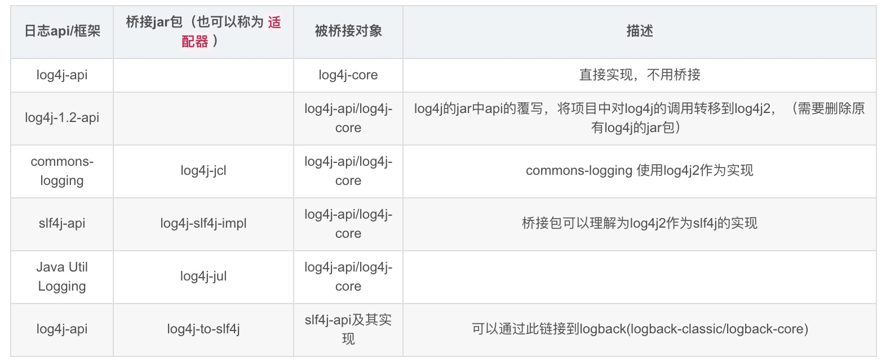

slf4j用来代替Commons Logging，Logback用来代替Log4j。

我们先来看看SLF4J对Commons Logging的接口有何改进。在Commons Logging中，我们要打印日志，有时候得这么写：

```java
int score = 99;
p.setScore(score);
log.info("Set score " + score + " for Person " + p.getName() + " ok.");
```

拼字符串是一个非常麻烦的事情，所以SLF4J的日志接口改进成这样了：

```java
int score = 99;
p.setScore(score);
logger.info("Set score {} for Person {} ok.", score, p.getName());
```

我们靠猜也能猜出来，SLF4J的日志接口传入的是一个带占位符的字符串，用后面的变量自动替换占位符，所以看起来更加自然。

如何使用SLF4J？它的接口实际上和Commons Logging几乎一模一样：

```java
import org.slf4j.Logger;
import org.slf4j.LoggerFactory;

class Main {
    final Logger logger = LoggerFactory.getLogger(getClass());
}
```

对比一下Commons Logging和SLF4J的接口：

| Commons Logging                       | SLF4J                   |
| :------------------------------------ | :---------------------- |
| org.apache.commons.logging.Log        | org.slf4j.Logger        |
| org.apache.commons.logging.LogFactory | org.slf4j.LoggerFactory |

使用SLF4J和Logback和前面讲到的使用Commons Logging加Log4j是类似的，先分别下载[SLF4J](https://www.slf4j.org/download.html)和[Logback](https://logback.qos.ch/download.html)，然后把以下jar包放到classpath下：

- slf4j-api-1.7.x.jar
- logback-classic-1.2.x.jar  改善了log4j,自身实现了SLF4j API
- logback-core-1.2.x.jar

然后使用SLF4J的Logger和LoggerFactory即可。和Log4j类似，我们仍然需要一个Logback的配置文件，把`logback.xml`放到classpath下，配置如下：

```xml
<?xml version="1.0" encoding="UTF-8"?>
<configuration>

	<appender name="CONSOLE" class="ch.qos.logback.core.ConsoleAppender">
		<encoder>
			<pattern>%d{HH:mm:ss.SSS} [%thread] %-5level %logger{36} - %msg%n</pattern>
		</encoder>
	</appender>

	<appender name="FILE" class="ch.qos.logback.core.rolling.RollingFileAppender">
		<encoder>
			<pattern>%d{HH:mm:ss.SSS} [%thread] %-5level %logger{36} - %msg%n</pattern>
			<charset>utf-8</charset>
		</encoder>
		<file>log/output.log</file>
		<rollingPolicy class="ch.qos.logback.core.rolling.FixedWindowRollingPolicy">
			<fileNamePattern>log/output.log.%i</fileNamePattern>
		</rollingPolicy>
		<triggeringPolicy class="ch.qos.logback.core.rolling.SizeBasedTriggeringPolicy">
			<MaxFileSize>1MB</MaxFileSize>
		</triggeringPolicy>
	</appender>

	<root level="INFO">
		<appender-ref ref="CONSOLE" />
		<appender-ref ref="FILE" />
	</root>
</configuration>
```


